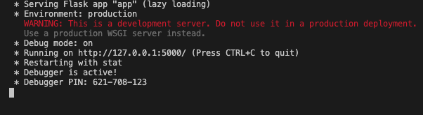
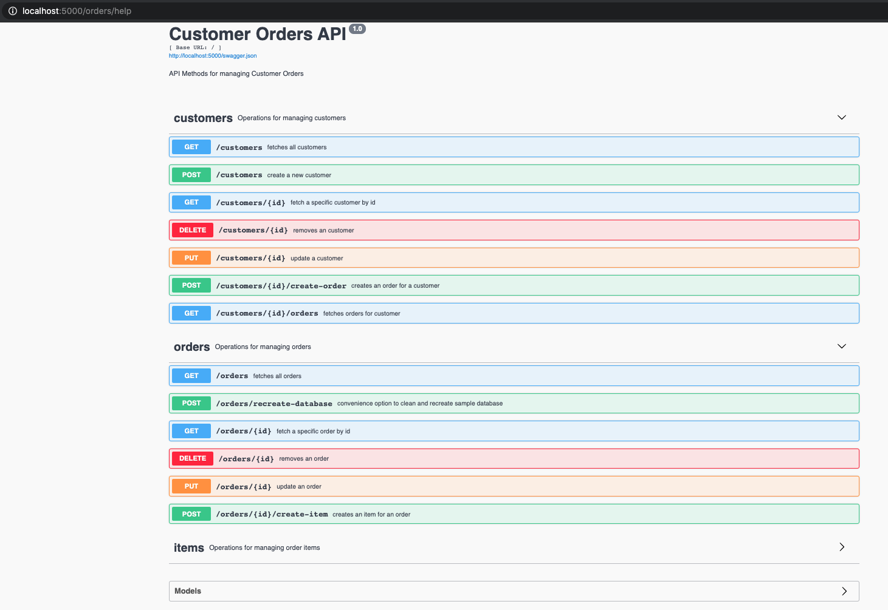
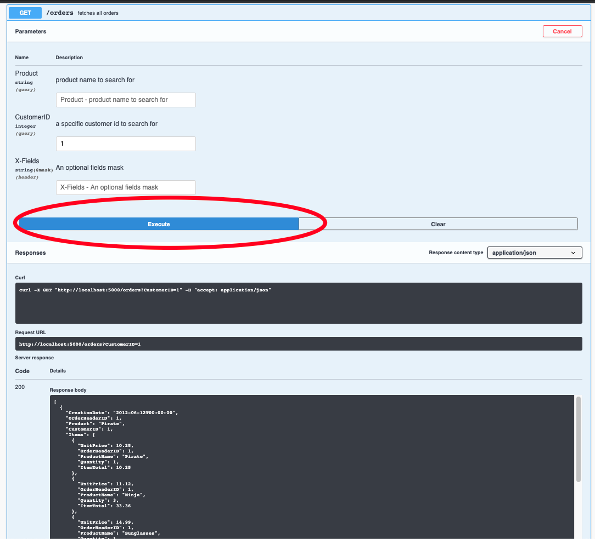

# orders-sqlalchemy-example
Example how to use python's [sqlalchemy]() module along with [flask](https://flask.palletsprojects.com/en/1.1.x/), [flask_restx](https://flask-restx.readthedocs.io/en/latest/), and [marshmallow](https://marshmallow.readthedocs.io/en/stable/index.html) to create a simple REST API with CRUD operations and documented in [SwaggerUI](https://swagger.io/tools/swagger-ui/).

# Install and setup
use the [requirements.txt](./requirements.txt) file to install the necessary packages into your python environment or a [virtual environment](https://docs.python.org/3/tutorial/venv.html).  


# running the app
Once the dependencies have been installed, simply run the [run.py](./run.py) to launch the REST API:

```python run.py```

this should start the service on the default port of `5000`:



navigate to [http://localhost:5000/orders/help](http://localhost:5000/orders/help) in a web browser (preferably Chrome) to launch the Swagger UI Help Docs:



# Testing the Api
The application should spin up some sample data before the first request.  The data can always be wiped clean and recreated using the `/orders/recreate-database` endpoint.

To test an endpoint, simply expand the operation and hit the `Try it out` button and then `Execute` to run the test:


